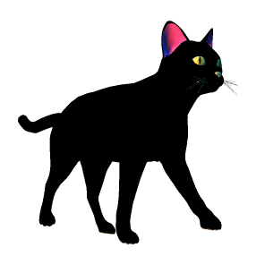

# 03 Catwalk - Base Version

# Author
**Author**: Gloria Paita  
**Email**: gloria.paita@edu-its.it  
**Course**: Web Developer 2024-2026

<br>

# Assignment

- The cat should start from the left side of the screen
- Write a function ‘catWalk()’ that moves the cat 10 pixels to the right
- Make the cat move across the screen by calling that function every 50ms

<br>
<br>

# Approach to Solution

## Setup

1. I've included an image of a cat in the HTML file.

   ```html
   
   ```

2. Then, in the `main.js` file I've added the following JavaScript code:

   ```javascript
   const cat = document.getElementsByTagName('img')[0];

   let catWalkStandard = function () {
       let oldXPosition = parseInt(cat.style.left);
       let newXPosition = oldXPosition + 10;
       cat.style.left = newXPosition + "px";
   };

   cat.style.position = "absolute";
   cat.style.left = "0px";
   window.setInterval(catWalkStandard, 50);
   ```

## Logic

1. **Cat Image Selection:**
   The script selects the first image (``) element in the HTML document.

   ```javascript
   const cat = document.getElementsByTagName('img')[0];
   ```

2. **Cat Movement Function:**
   The function `catWalkStandard` moves the cat 10 pixels to the right every time it is called by updating its `left` position.

   ```javascript
   let catWalkStandard = function () {
       let oldXPosition = parseInt(cat.style.left);
       let newXPosition = oldXPosition + 10;
       cat.style.left = newXPosition + "px";
   };
   ```

3. **Position Initialization:**
   The cat's position is set to `absolute`, and its initial `left` value is set to `0px` (starting on the left side of the screen).

   ```javascript
   cat.style.position = "absolute";
   cat.style.left = "0px";
   ```

4. **Animation:**
   The `setInterval` function calls `catWalkStandard` every 50 milliseconds, which makes the cat move continuously.

   ```javascript
   window.setInterval(catWalkStandard, 50);
   ```

<br>

## Notes: Modifications to Provided HTML

The original HTML included the following image element:

```html

```

However, when loading this over HTTPS (as modern browsers often do by default), Firefox blocked the image due to a **mixed content error** — this occurs when secure (HTTPS) pages attempt to load insecure (HTTP) resources.

To resolve this, I downloaded the walking cat GIF and saved it locally under the project’s `assets/gifs/` directory. I then updated the image `src` attribute and added an `alt` description accordingly:

```html

```

This change ensures the image loads correctly in all modern browsers without security warnings or content blocking, and improves the project's compatibility and reliability when served over HTTPS.